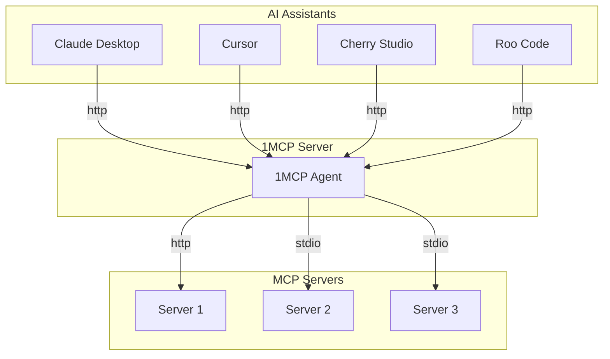
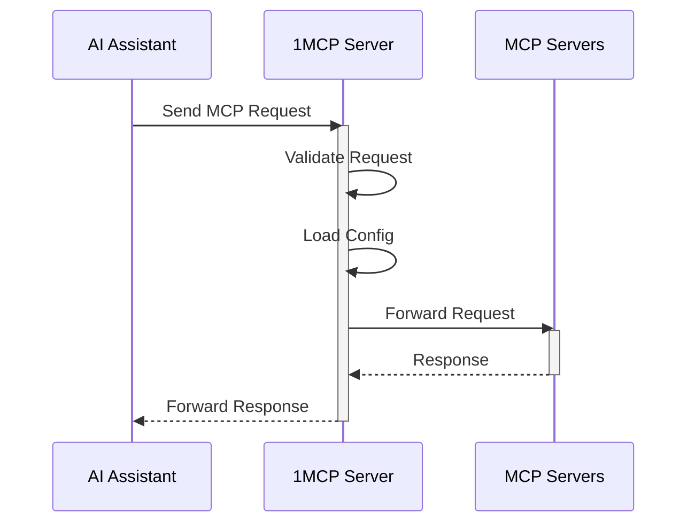

# 1MCP - One MCP Server for All

A unified Model Context Protocol server implementation that aggregates multiple MCP servers into one.

[](https://www.npmjs.com/package/@1mcp/agent)
[](https://www.npmjs.com/package/@1mcp/agent)
[](https://smithery.ai/server/@1mcp-app/agent)

## Table of Contents

- [Overview](#overview)
- [Features](#features)
- [Quick Start](#quick-start)
- [Prerequisites](#prerequisites)
- [Usage](#usage)
- [Docker](#docker)
- [Trust Proxy Configuration](#trust-proxy-configuration)
- [Understanding Tags](#understanding-tags)
- [Configuration](#configuration)
- [Authentication](#authentication)
- [Health Monitoring](#health-monitoring)
- [How It Works](#how-it-works)
- [Development](#development)
- [Contributing](#contributing)
- [License](#license)

## Overview

1MCP (One MCP) is designed to simplify the way you work with AI assistants. Instead of configuring multiple MCP servers for different clients (Claude Desktop, Cherry Studio, Cursor, Roo Code, Claude, etc.), 1MCP provides a single, unified server.

## Features

- **Unified Interface**: Aggregates multiple MCP servers into one.
- **Resource Friendly**: Reduces system resource usage by eliminating redundant server instances.
- **Simplified Configuration**: Simplifies configuration management across different AI assistants.
- **Standardized Interaction**: Provides a standardized way for AI models to interact with external tools and resources.
- **Dynamic Configuration**: Supports dynamic configuration reloading without server restart.
- **Graceful Shutdown**: Handles graceful shutdown and resource cleanup.
- **Secure**: Includes comprehensive authentication and security features.
- **Optimized**: Supports advanced filtering, pagination, and request optimization.
- **Health Monitoring**: Built-in health check endpoints for monitoring and observability.

## Quick Start

To enable Cursor to use existing MCP servers already configured in Claude Desktop, follow these steps:

1. Run the 1MCP server with the Claude Desktop config file:

```bash
npx -y @1mcp/agent --config ~/Library/Application\ Support/Claude/claude_desktop_config.json
```

2. Add the 1MCP server to your Cursor config file (`~/.cursor/mcp.json`):

```json
{
  "mcpServers": {
    "1mcp": {
      "type": "http",
      "url": "http://localhost:3050/sse"
    }
  }
}
```

3. Enjoy it!

## Prerequisites

- [Node.js](https://nodejs.org/) (version 21 or higher)
- [pnpm](https://pnpm.io/)

## Usage

You can run the server directly using `npx`:

```bash
# Basic usage (starts server with SSE transport)
npx -y @1mcp/agent

# Use existing Claude Desktop config
npx -y @1mcp/agent --config ~/Library/Application\ Support/Claude/claude_desktop_config.json

# Use stdio transport instead of SSE
npx -y @1mcp/agent --transport stdio

# Use external URL for reverse proxy setup (nginx, etc.)
npx -y @1mcp/agent --external-url https://example.com

# Configure trust proxy for reverse proxy setup
npx -y @1mcp/agent --trust-proxy=192.168.1.1

# Show all available options
npx -y @1mcp/agent --help
```

Available options:

| Option (CLI)                 | Environment Variable               | Description                                                                   |  Default   |
| :--------------------------- | :--------------------------------- | :---------------------------------------------------------------------------- | :--------: |
| `--transport`, `-t`          | `ONE_MCP_TRANSPORT`                | Choose transport type ("stdio", "http", or "sse")                             |   "http"   |
| `--config`, `-c`             | `ONE_MCP_CONFIG`                   | Use a specific config file                                                    |            |
| `--port`, `-P`               | `ONE_MCP_PORT`                     | Change HTTP port                                                              |    3050    |
| `--host`, `-H`               | `ONE_MCP_HOST`                     | Change HTTP host                                                              | localhost  |
| `--external-url`, `-u`       | `ONE_MCP_EXTERNAL_URL`             | External URL for OAuth callbacks and public URLs (e.g., https://example.com)  |            |
| `--trust-proxy`              | `ONE_MCP_TRUST_PROXY`              | Trust proxy configuration for client IP detection (boolean, IP, CIDR, preset) | "loopback" |
| `--tags`, `-g`               | `ONE_MCP_TAGS`                     | Filter servers by tags                                                        |            |
| `--pagination`, `-p`         | `ONE_MCP_PAGINATION`               | Enable pagination for client/server lists (boolean)                           |   false    |
| `--enable-auth`              | `ONE_MCP_ENABLE_AUTH`              | Enable authentication (OAuth 2.1)                                             |   false    |
| `--enable-scope-validation`  | `ONE_MCP_ENABLE_SCOPE_VALIDATION`  | Enable tag-based scope validation (boolean)                                   |    true    |
| `--enable-enhanced-security` | `ONE_MCP_ENABLE_ENHANCED_SECURITY` | Enable enhanced security middleware (boolean)                                 |   false    |
| `--session-ttl`              | `ONE_MCP_SESSION_TTL`              | Session expiry time in minutes (number)                                       |    1440    |
| `--session-storage-path`     | `ONE_MCP_SESSION_STORAGE_PATH`     | Custom session storage directory path (string)                                |            |
| `--rate-limit-window`        | `ONE_MCP_RATE_LIMIT_WINDOW`        | OAuth rate limit window in minutes (number)                                   |     15     |
| `--rate-limit-max`           | `ONE_MCP_RATE_LIMIT_MAX`           | Maximum requests per OAuth rate limit window (number)                         |    100     |
| `--health-info-level`        | `ONE_MCP_HEALTH_INFO_LEVEL`        | Health endpoint information detail level ("full", "basic", "minimal")         | "minimal"  |
| `--help`, `-h`               |                                    | Show help                                                                     |            |

## Docker

You can also run 1MCP using Docker:

```bash
# Pull the latest image
docker pull ghcr.io/1mcp-app/agent:latest

# Run with HTTP transport (default)
docker run -p 3050:3050 ghcr.io/1mcp-app/agent

# Run with a custom config file
docker run -p 3050:3050 -v /path/to/config.json:/config.json ghcr.io/1mcp-app/agent --config /config.json

# Run with stdio transport
docker run -i ghcr.io/1mcp-app/agent --transport stdio
```

Available image tags:

- `latest`: Latest stable release
- `vX.Y.Z`: Specific version (e.g. `v1.0.0`)
- `sha-<commit>`: Specific commit

Examples:

```bash
# Custom port and tags
docker run -p 3051:3051 \
  -e ONE_MCP_PORT=3051 \
  -e ONE_MCP_TAGS=network,filesystem \
  ghcr.io/1mcp-app/agent

# With external URL for reverse proxy
docker run -p 3050:3050 \
  -e ONE_MCP_EXTERNAL_URL=https://mcp.example.com \
  -e ONE_MCP_TRUST_PROXY=true \
  ghcr.io/1mcp-app/agent
```

## Trust Proxy Configuration

When running 1MCP behind a reverse proxy, configure trust proxy settings for proper client IP detection:

```bash
# Default (safe for local development)
npx -y @1mcp/agent --trust-proxy=loopback

# Behind reverse proxy
npx -y @1mcp/agent --trust-proxy=192.168.1.1

# Behind CDN/Cloudflare
npx -y @1mcp/agent --trust-proxy=true
```

See [docs/TRUST_PROXY.md](docs/TRUST_PROXY.md) for detailed configuration options, security considerations, and reverse proxy setup examples.

## Understanding Tags

Tags help you control which MCP servers are available to different clients. Think of tags as labels that describe what each server can do.

### How to Use Tags

1. **In your server config**: Add tags to each server to describe its capabilities

```json
{
  "mcpServers": {
    "web-server": {
      "command": "uvx",
      "args": ["mcp-server-fetch"],
      "tags": ["network", "web"],
      "disabled": false
    },
    "file-server": {
      "command": "npx",
      "args": ["-y", "@modelcontextprotocol/server-filesystem", "~/Downloads"],
      "tags": ["filesystem"],
      "disabled": false
    }
  }
}
```

2. **When starting 1MCP in stdio mode**: You can filter servers by tags

```bash
# Only start servers with the "network" tag
npx -y @1mcp/agent --transport stdio --tags "network"

# Start servers with either "network" or "filesystem" tags
npx -y @1mcp/agent --transport stdio --tags "network,filesystem"
```

3. **When using SSE transport**: Clients can request servers with specific tags

```json
{
  "mcpServers": {
    "1mcp": {
      "type": "http",
      "url": "http://localhost:3050/sse?tags=network" // Only connect to network-capable servers
    }
  }
}
```

Example tags:

- `network`: For servers that make web requests
- `filesystem`: For servers that handle file operations
- `memory`: For servers that provide memory/storage
- `shell`: For servers that run shell commands
- `db`: For servers that handle database operations

## Configuration

### Global Configuration

The server automatically manages configuration in a global location:

- macOS/Linux: `~/.config/1mcp/mcp.json`
- Windows: `%APPDATA%/1mcp/mcp.json`

### Configuration File Format

```json
{
  "mcpServers": {
    "mcp-server-fetch": {
      "command": "uvx",
      "args": ["mcp-server-fetch"],
      "disabled": false
    },
    "server-memory": {
      "command": "npx",
      "args": ["-y", "@modelcontextprotocol/server-memory"],
      "disabled": false
    }
  }
}
```

## Authentication

1MCP supports OAuth 2.1 for secure authentication. To enable it, use the `--enable-auth` flag. The `--auth` flag is deprecated and will be removed in a future version.

When authentication is enabled, 1MCP acts as an OAuth 2.1 provider, allowing client applications to securely connect. This ensures that only authorized clients can access the MCP servers.

## Health Monitoring

1MCP provides comprehensive health check endpoints for monitoring and observability:

### Health Check Endpoints

- **`GET /health`** - Complete health status including system metrics, server status, and configuration
- **`GET /health/live`** - Simple liveness probe (always returns 200 if server is running)
- **`GET /health/ready`** - Readiness probe (returns 200 if configuration is loaded and ready)

### Health Status Levels

- **`healthy`** - All systems operational (HTTP 200)
- **`degraded`** - Some issues but still functional (HTTP 200)
- **`unhealthy`** - Critical issues affecting functionality (HTTP 503)

### Monitoring Integration

Use these endpoints with:

- Load balancers (health checks)
- Container orchestration (Kubernetes health probes)
- CI/CD pipelines (deployment validation)

## How It Works

1MCP acts as a proxy, managing and aggregating multiple MCP servers. It starts and stops these servers as subprocesses and forwards requests from AI assistants to the appropriate server. This architecture allows for a single point of entry for all MCP traffic, simplifying management and reducing overhead.

### System Architecture



### Request Flow



## Development

Install dependencies:

```bash
pnpm install
```

Build the server:

```bash
pnpm build
```

For development with auto-rebuild:

```bash
pnpm watch
```

Run the server:

```bash
pnpm dev
```

### Debugging

Using the [MCP Inspector](https://github.com/modelcontextprotocol/inspector), which is available as a package script:

```bash
pnpm inspector
```

The Inspector will provide a URL to access debugging tools in your browser.

### Debugging & Source Maps

This project uses [source-map-support](https://www.npmjs.com/package/source-map-support) to enhance stack traces. When you run the server, stack traces will reference the original TypeScript source files instead of the compiled JavaScript. This makes debugging much easier, as error locations and line numbers will match your source code.

No extra setup is required—this is enabled by default. If you see a stack trace, it will point to `.ts` files and the correct line numbers. 🗺️

## Contributing

Contributions are welcome! Please read our [CONTRIBUTING.md](CONTRIBUTING.md) for details on our code of conduct, and the process for submitting pull requests to us.

## License

This project is licensed under the Apache License 2.0. See the [LICENSE](LICENSE) file for details.
